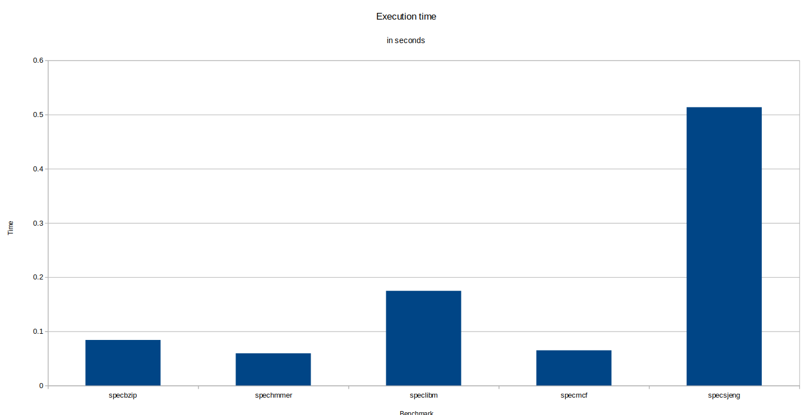
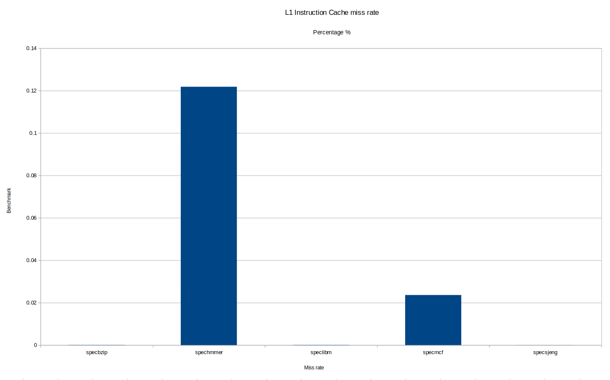

## Benchmark analysis
For this part of the assignment we will run 5 benchmarks on the se.py configuration and the MinorCPU. 

At the section [System] it is reported that the caches have 64 byte lines (cache_line_size=64). furthermore we find the following settings for the system:

### L1 caches
from the config.ini file in the section [system.cpu.dcache] we find that the dcache size is 64Kb (size=65536) and the associativity is 2 (assoc=2).
Also from the config.ini file in the section [system.cpu.icache] we find that the icache size is 32Kb (size=32768) and the associativity is 2 (assoc=2).

### L2 caches
From the section [system.l2] we find that the L2 cache is 2MB (size=2097152) and the associativity is 8 (assoc=8)

### RAM
At the section [System] it is reported that the RAM is 512MB (device_size=536870912) and from the [system.mem_ctrls] the voltage is 1.5V (used for DDR3), banks_per_rank=8, device_bus_width=8, tCK=1250 = 1.25ns or 800MHz. the bus size is banks_per_rank * device_bus_width = 64. All these point to a DDR3_1600_x64.

| test | specbzip | spechmmer | speclibm | specmcf | specsjeng|
|:-:|:-:|:-:|:-:|:-:|:-:|
| execution time | 0.083982 | 0.059396 | 0.174671 | 0.064955 | 0.513528 |
| CPI | 1.679650 | 1.187917 | 3.493415 | 1.299095 | 10.270554 |
| L1 Inst miss rate | 0.000077 | 0.121818 | 0.000094 | 0.023612 | 0.000020 |
| L1 Data miss rate | 0.014798 | 0.082925 | 0.060972 | 0.002108 | 0.121831 |
| L2 miss rate | 0.282163 | 0.077760 | 0.999944 | 0.055046 | 0.999972 |
| #Instructions | 100000001 | 100000000 | 100000000 | 100000001 | 100000000 |
| #Committed Ops | 100196363 | 101102729 | 100003637 | 109431937 | 184174857 |

### Graphs

#### Execution Time

#### CPI

#### L1 Instruction Cache Miss Rate

#### L1 Data Cache Miss Rate

#### L2 Cache Miss Rate

### Observations
- **Execution Time**: specsjeng has the highest execution time (0.513528 s), followed by speclibm (0.174671 s), specbzip (0.083982 s), specmcf (0.064955 s), and spechmmer has the lowest (0.059396 s).
- **CPI**: specsjeng has the highest CPI (10.270554), indicating high cycles per instruction, likely due to poor cache performance. spechmmer has the lowest CPI (1.187917), showing efficient execution.
- **L1 Inst Miss Rate**: Generally low, with spechmmer having the highest (0.121818), others below 0.024. This shows the program has bad spatial locality, with many jumps.
- **L1 Data Miss Rate**: Varies, with specsjeng highest (0.121831), specmcf lowest (0.002108).
- **L2 Miss Rate**: Very high for speclibm and specsjeng (~1.0), meaning most accesses miss L2, leading to main memory access. spechmmer has low L2 miss rate (0.077760), indicating good locality.
- Overall, benchmarks with high L2 miss rates tend to have higher CPI and execution times, as memory accesses are costly. spechmmer performs well with low miss rates and CPI.
  

