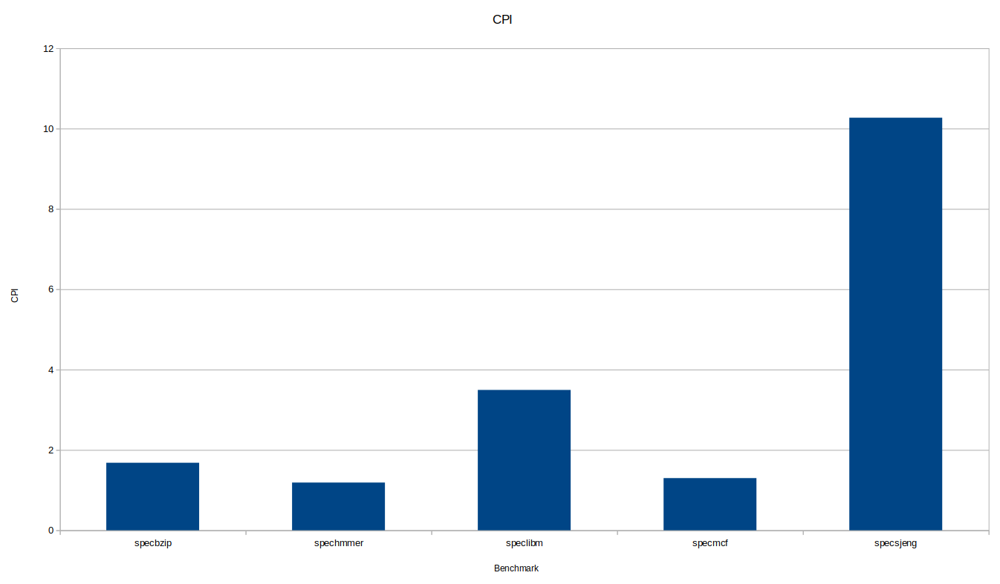
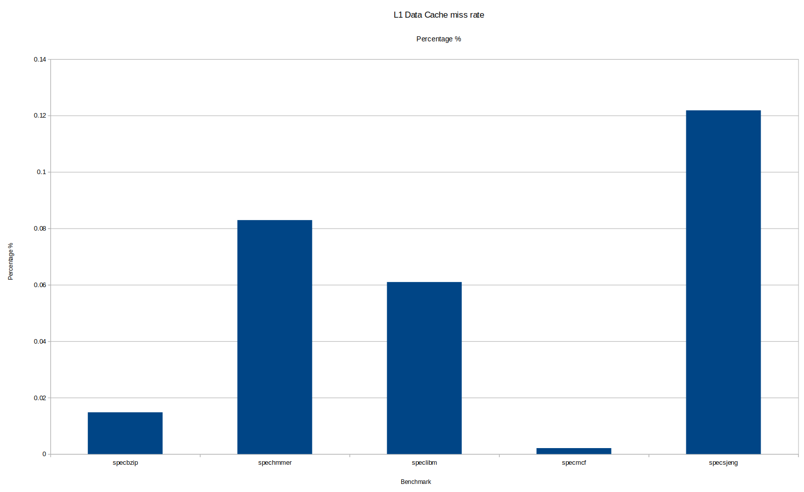
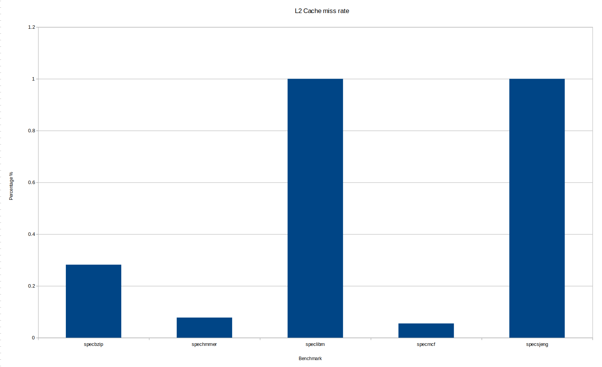
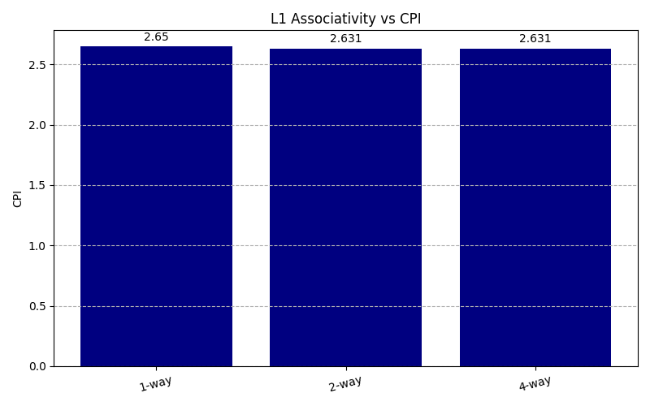
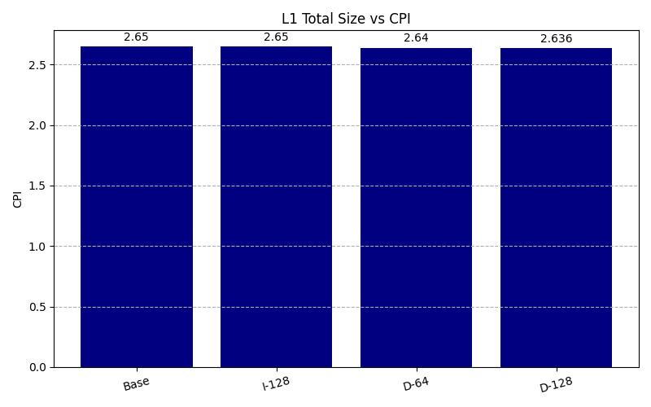
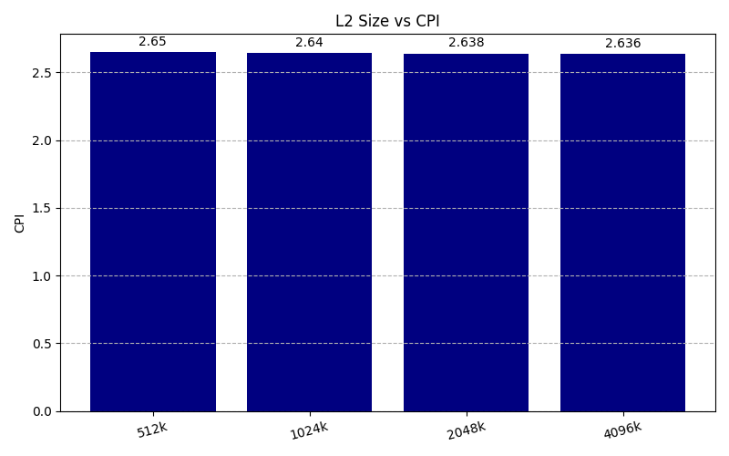
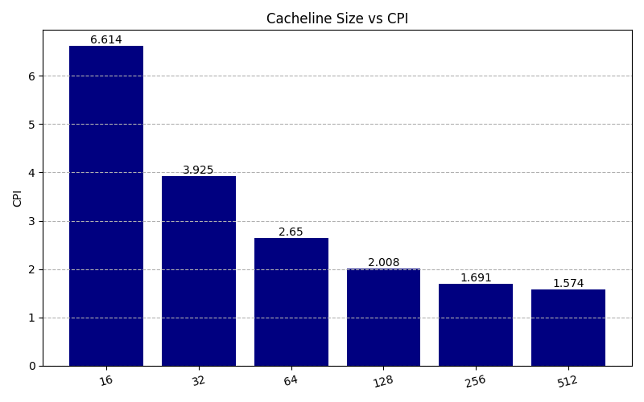
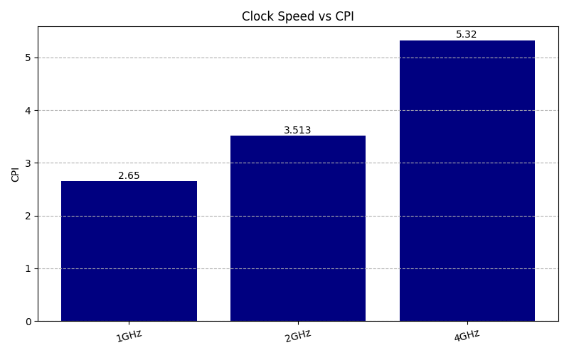

## **<center> name: Papaprokopiou Panagiotis **
## **<center> Academic Transcript**: 11033
## **<center> mail: papaprokp@ece.auth.gr **


# Introduction
  This report is part of the _"Advanced Acceletor and CPU Architecture"_ course at the Aristotle University of Thessaloniki. The exercise covers the _"GEM 5"_ simulator and shall familiarize the student with the tool

  A Linux 19.10 Virtual Machine (VM) was used to simulate the CPU's, using gcc version 7.5.0, python 2.7.17. The projects are built for ARM Instruction set Architectures and done so using System call Emulation.

# First part   
In the first part it is asked to run the _"./build/ARM/gem5.opt -d hello_result configs/example/arm/starter_se.py --cpu="minor" "tests/test-progs/hello/bin/arm/linux/hello"_ command that simulates the _"starter_se.py"_ file with the _"minorCPU"_. According to the stats.txt we conclude that 
* the Simulator instruction rate is 299655 inst/s
* The frequency was 1GHz
* Number of instructions simulated 5027
* Number of ops (including micro ops) simulated 5831
* CPI: 6.991048 = 7
* IPC (Instructions Per Cycle) 0.143
* Total number of cycles that the object has spent stopped 24816
* number of cpu cycles simulated 35144
* Number of conditional branches predicted 1359
* Number of miss predicted indirect branches 63
* Number of BTB hits 395
* BTB Hit Percentage 20.5%
* Number of bytes read from this memory (total) 10688
* Total number of bytes read from DRAM 15040
* L1 Instruction Cache number of demand (read+write) accesses 2793
* L1 Instruction Cache number of demand (read+write) hits 2466
* L1 Instruction Cache hit percentage 88.3%
* L1 Data Cache number of demand (read+write) accesses 2160
* L1 Data Cache number of demand (read+write) hits 1983
* L1 Data Cache hit percentage 91.8%
* L2 total number of demand (read+write) accesses 474
* L2 number of overall misses 474
  

from the config.ini we confirm that
* it is a single core cpu (cpu_id=0)
* memory is 2Gb (mem_ranges=0:2147483647)
* L1 Instruction Cache is 48Kb 3 way set associative (addr_ranges=0:18446744073709551615
assoc=3)
* L1 Data Cache is 32Kb 2 way set associative (addr_ranges=0:18446744073709551615
assoc=2)
* L2 Cache is 1Mb 16 way set associative (addr_ranges=0:18446744073709551615
assoc=16)
* L2 hit access time is 12 cycles (data_latency=12)

The sim_ticks is the total amount of the simulation tun time in ticks, hereby 35144000. Each tick is 1 ps, specified by the clock period.

sim_seconds is the total simulated time in seconds, hereby 0.000035 = 35 ms. This is derived bt dividing sim_ticks / sim_freq.

sim_insts is the number of committed instructions finished by the simulated cpu, hereby 5027.

host_insts_rate is the simulator's efficiency and is calculated by the number of instructions processed per second. hereby 299655 inst/s

**L1 and L2 accesses:**
* The L1 Instruction Cache accesses were 2793 (icache.demand_accesses::total)  
* The L1 Data Cache accesses were 2160 (dcache.demand_accesses::total)  
* Total L1 Cache accesses were 4953 (icache.demand_accesses::total + dcache.demand_accesses::total)  
* The L2 Cache accesses were 474 (system.cpu_cluster.l2.demand_accesses::total)


We could also calculate the Cache accesses by the following methodes:   
**L1 D-Cache Accesses**: Sum all the individual request types sent from the CPU to the data cache:  
Accesses = ReadReq Hits + ReadReq Misses + WriteReq Hits + WriteReq Misses  
**L2 Cache Accesses**: The L2 cache is only accessed when there is a miss in the L1 caches. Therefore:  
L2 Accesses = L1 Instruction Cache Misses + L1 Data Cache Misses


## Minor CPU
The **minor CPU** utilizes **in-order processor** with **fixed pipeline** and **configurable data structures** for strict sequential execution. Enables micro-architectural correlation with real processors and pipeline visualization via MinorTrace/minorview.py.

Design Philosophy:

* Multithreading: Unsupported; placeholders for future support.
Data Structures: Fixed-size at construction; BubbleIF for queues; value-passed inter-stage data; limited dynamic allocation (MinorDynInst, ForwardLineData, FetchRequests, LSQRequests).
* Model Structure: MinorCPU (cpu.hh interfaces) → Pipeline (tick/idling) → Fetch1 (I-cache fetch), Fetch2 (line decomposition), Decode (micro-op), Execute (execution/LSQ).

**Key Data Structures:**

* InstId: Tracks identity (T/S.P/L/F.E fields for sequencing).
* MinorDynInst: Instructions as bubbles/faults/decoded insts; ref-counted.
* ForwardLineData/InstData: Pass lines/insts with bubble/fault support.
* Fetch1::FetchRequest/LSQ::LSQRequest: Handle cache requests.

**Pipeline:** Stages connected by MinorBuffer FIFOs; reverse evaluation for stalling; activity-based idling.

**Stages:**

* Fetch1: Fetches lines, manages queues, reserves Fetch2 space.
* Fetch2: Decomposes lines, predicts branches, discards mismatches.
* Decode: Micro-op decomposition, packs outputs.
* Execute: Issues/commits via FU pipelines (SelfStallingPipelines), scoreboard for deps, LSQ for memory.
* Features: Functional units with delays; LSQ for requests/transfers/store buffer; draining; debugging flags (e.g., MinorTrace for minorview.py visualization). Emphasizes timing accuracy and in-order simulation.

## O3 CPU

The **O3CPU** is gem5's **detailed out-of-order processor model** designed for **high timing accuracy**. It features an **execute-in-execute** approach to simulate instructions during the pipeline's execute stage, **avoiding errors from early execution** and **preserving out-of-order load interactions**. The model uses template policies for polymorphism without virtual functions, enabling compile-time CPU definition, and separates ISA-dependent code for easier future ISA implementations. Interactions with ThreadContext allow reads but require pipeline flushes for writes to maintain architectural state integrity.

**Pipeline Stages**
* Fetch: Retrieves instructions, creates DynInst objects, selects threads, and manages branch prediction.
* Decode: Decodes instructions and resolves PC-relative unconditional branches early.
* Rename: Renames registers using a physical register file; stalls for resource shortages or serializing instructions.
* Issue/Execute/Writeback (IEW): Dispatches to instruction queue, issues to functional units, executes, and writes back results.
* Commit: Commits instructions, handles faults, and redirects on branch mispredictions.

Backend Pipeline Details
* Compute Instructions: Follow a chain from rename (register renaming, resource checks) to dispatch (insertion into IQ/LSQ), schedule (ready list management, FU assignment), execute (invocation of execute() function), writeback (waking dependents), and commit (ROB release).
* Load Instructions: Execute similarly to computes until LSQUnit::executeLoad(), which initiates access, handles aliasing/forwarding, sends cache requests, and completes via writeback and commit, waking dependents.
* Store Instructions: Execute like loads but defer cache writes until commit; LSQUnit::commitStores() and writebackStores() send packets post-commit, with completion releasing SQ entries.
* Misspeculations: Branch mispredictions trigger squashing in IEW; memory order violations (detected via MemDepUnit and LSQ checks) block/reschedule loads or squash on aliasing issues.

This model emphasizes timing precision, resource management, and accurate simulation of out-of-order execution.

## Simple CPU
The **SimpleCPU** is a functional, **in-order processor model** for scenarios **not requiring detailed simulation**, such as warm-ups, client systems, or basic testing. It **supports** the **new memory system** and consists of three classes.

**BaseSimpleCPU:** Base class holding architected state and common stats. Defines functions for interrupts, fetch requests, pre/post-execute actions, PC advancement, and implements ExecContext. Cannot run standalone; must inherit from AtomicSimpleCPU or TimingSimpleCPU.

**AtomicSimpleCPU:** Uses **atomic memory accesses** for latency estimates. Derives from BaseSimpleCPU; implements memory read/write, tick cycle, and defines ports to connect to cache/memory.

**TimingSimpleCPU:** Uses **timing memory accesses**, stalling on cache responses. Derives from BaseSimpleCPU; implements similar functions, ports, and response handling for memory accesses.

## Trace CPU
The **TraceCPU** replays elastic traces generated by the O3 CPU's Elastic Trace Probe, **enabling fast and accurate memory-system** (cache, interconnects, DRAM) performance exploration for **single-threaded benchmarks** in SE/FS modes. Traces capture dependencies and timing, correlated for SPEC 2006 and HPC apps, and are portable to other simulators.

**Elastic Trace Generation:**

* Uses Elastic Trace Probe on O3 CPU to monitor instructions, creating dependency graphs (RAW, order deps) and outputting two protobuf-encoded files: instruction fetch trace and elastic data memory trace.
* Trace Formats: Data trace includes seq_num, type (LOAD/STORE/COMP), p_addr, size, flags, rob_dep, comp_delay, reg_dep, weight, pc, v_addr, asid. Fetch trace includes tick, cmd, addr, size, flags, pkt_id, pc.
* Scripts/Options: SE mode via etrace_se.py with --inst-trace-file and --data-trace-file. FS mode: Checkpoint with O3 CPU, resume with tracing enabled. Requires protobuf installation.

**Replay with Trace CPU:**

* TraceCPU inherits from Base CPU, interfaces with L1 caches, and consumes traces for replay.
* Scripts/Options: Use etrace_replay.py with --data-trace-file, --inst-trace-file, --caches, --mem-size, etc., for SE/FS replay. Fields match generation traces for dependency/timing simulation.


## Results from executing main_ARM on MinorCPU and TimingSimpleCPU
We create the C program that reads a natural number N and calculates the sum of numbers up until N. Then we execute the program using the MinorCPU and the TimingSimpleCPU
| Stats   |   Minor CPU   | TimingSimple CPU | Notes|
|:----------:|:-------------:|:------:|:------:|
| sim_insts | 11,257 | 11,202 | Nearly the same |
| sim_ops | 12,772 | 12,663 | Minor has more due to micro-op decomposition |
| numCycles | 72,232 | 87,476 | Minor needed less cycles |
| idleCycles | 51,776 | 0 | Timing Simple was always busy |
| host_inst_rate | 268,224 | 622,472 | TimingSimple calculates faster |
| sim_seconds (us) | 36 | 44 | TimingSimple needed more time |
| CPI | 6.416630 | 7.8 | For TimingSimple calculated as 87,476 Cycles / 11,202 Instructions | 

### Explanation
#### Similarities
* sim_insts (instructions simulated): Nearly identical (11,257 vs. 11,202).
Reason: Both run the same executable (e.g., a "hello" or similar program), so the total dynamic instruction count is workload-dependent and not affected by CPU model internals. The slight difference (~0.5%) could be due to Minor's micro-op decomposition or minor execution variations, but it's negligible.

* sim_ops (ops including micro-ops): Close (12,772 vs. 12,663).
Reason: Ops represent the total operations (instructions + micro-ops). Minor decomposes instructions into micro-ops for pipeline accuracy, leading to ~1% more ops. TimingSimple treats instructions more functionally, with fewer breakdowns. Both reflect the same workload, so similarity holds.

#### Differences
* sim_ticks/sim_seconds (total ticks/simulated time): TimingSimple longer (43.7M ticks / 0.000044s vs. 36.1M / 0.000036s).
Reason: TimingSimple stalls on every memory access (timing mode), waiting for cache/memory responses, inflating simulated time. Minor models pipeline stages more efficiently, with less waiting, leading to faster simulated execution despite idling.

* CPI (cycles per instruction): Minor better (6.42 CPI vs. 7.80).
Reason: Minor's detailed pipeline (fixed stages, configurable structures) accurately simulates in-order flow, reducing wasted cycles. TimingSimple's functional approach overestimates latencies (e.g., atomic accesses assume worst-case times), increasing CPI. 

* host_inst_rate (simulator efficiency, inst/s): TimingSimple faster (622,472 vs. 268,224).
Reason: TimingSimple is simpler (no detailed pipeline stages, fewer internal structures), so the host simulates it quicker. Minor's complexity (e.g., pipeline evaluation, activity recording) adds overhead, slowing host-side processing despite better simulated performance.

* numCycles (CPU cycles): TimingSimple more (87,476 vs. 72,232).
Reason: Aligns with higher CPI—TimingSimple's stalls and simpler execution require more cycles. Minor's accurate modeling minimizes cycles by optimizing in-order flow.

* idleCycles/idle_fraction: Minor has significant idling (51,776 cycles / ~72% idle vs. almost 0).
Reason: Minor includes pipeline idling (e.g., for synchronization, event handling) to mimic real hardware accurately. TimingSimple doesn't model idling, as it's purely functional and busy-focused, assuming continuous execution.

* Instruction Breakdowns (e.g., loads, stores, branches): TimingSimple has detailed counts (e.g., 2,063 loads, 1,926 stores, 2,143 branches); Minor lacks or has pipeline-focused stats.
Reason: TimingSimple tracks functional execution details for simplicity. Minor prioritizes pipeline internals (e.g., fetch2 instruction types, branch prediction) over per-instruction counts, as it's designed for micro-architectural analysis.

## Modifying the parameters
We modify the available L1 Instruction and Data cache with the _"--l1d_size = 512B --l1i_size = 512B"_ flag. We reduce it because the program is very simple and in order to see more differentiated statistics.

 Stats   |   Minor CPU   | TimingSimple CPU | Notes|
|:----------:|:-------------:|:------:|:------:|
| sim_insts | 11,202 | 11,257 | same as before modification |
| sim_ops | 12,772 | 12,663 | same as before modification |
| numCycles | 147,314 | 151,618 | Higher | 
| idleCycles | 122,772 | 0.002 | Higher | 
| host_inst_rate | 329,767 | 1,119,807 |  | 
| sim_seconds (us) | 74 | 76 | Significant more time | 
| CPI | 13.086 | 7.80 | Minor CPI higher | 

### Explanation for 512B Cache Results

#### Similarities
* sim_insts and sim_ops: Identical to the original configuration (11,202 / 11,257 insts, 12,663 / 12,772 ops).
  Reason: These metrics are primarily determined by the workload (the ARM executable), not the cache size. The instruction count remains consistent across runs for the same program, as cache size affects timing but not the total dynamic instructions executed.

#### Differences
* numCycles: Both CPUs require significantly more cycles (147,314 for Minor, 151,618 for TimingSimple) compared to the original (~72k-87k).
  Reason: With a tiny 512B cache, cache misses are frequent, causing the CPU to stall waiting for memory accesses. This inflates the cycle count as the pipeline can't proceed efficiently.

* idleCycles: Minor has extremely high idling (122,772 cycles, ~83% idle), while TimingSimple has negligible idling (0.002 cycles).
  Reason: Minor models detailed pipeline behavior, including idling during stalls for cache misses or synchronization. TimingSimple, being functional, doesn't simulate idling and assumes continuous execution, though it still experiences stalls internally.

* host_inst_rate: TimingSimple remains faster to simulate (1,119,807 inst/s vs. Minor's 329,767).
  Reason: TimingSimple's simpler model (no complex pipeline stages) allows quicker host-side computation, even with increased simulated cycles due to misses.

* sim_seconds: Both take longer (74-76 μs vs. ~36-44 μs originally).
  Reason: More cycles and stalls translate to longer simulated time. The small cache amplifies memory latency effects, slowing down the simulation proportionally.

* CPI: Minor's CPI worsens significantly (13.086 vs. original 6.42), while TimingSimple's stays the same (7.80).
  Reason: Small caches lead to higher miss rates, increasing stalls and thus CPI. Minor's detailed modeling captures this more accurately, showing a bigger jump. TimingSimple's functional approach may underestimate some latencies, keeping CPI stable.

Overall, the 512B cache highlights the critical role of cache size in performance: small caches cause frequent misses, degrading CPI and efficiency, especially in detailed models like Minor. TimingSimple trades accuracy for speed, showing less variation but still impacted.

## Benchmark analysis
For this part of the assignment we will run 5 benchmarks on the se.py configuration and the MinorCPU. 

At the section [System] it is reported that the caches have 64 byte lines (cache_line_size=64). furthermore we find the following settings for the system:

### L1 caches
from the config.ini file in the section [system.cpu.dcache] we find that the dcache size is 64Kb (size=65536) and the associativity is 2 (assoc=2).
Also from the config.ini file in the section [system.cpu.icache] we find that the icache size is 32Kb (size=32768) and the associativity is 2 (assoc=2).

### L2 caches
From the section [system.l2] we find that the L2 cache is 2MB (size=2097152) and the associativity is 8 (assoc=8)

### RAM
At the section [System] it is reported that the RAM is 512MB (device_size=536870912) and from the [system.mem_ctrls] the voltage is 1.5V (used for DDR3), banks_per_rank=8, device_bus_width=8, tCK=1250 = 1.25ns or 800MHz. the bus size is banks_per_rank * device_bus_width = 64. All these point to a DDR3_1600_x64.

| test | specbzip | spechmmer | speclibm | specmcf | specsjeng|
|:-:|:-:|:-:|:-:|:-:|:-:|
| execution time | 0.083982 | 0.059396 | 0.174671 | 0.064955 | 0.513528 |
| CPI | 1.679650 | 1.187917 | 3.493415 | 1.299095 | 10.270554 |
| L1 Inst miss rate | 0.000077 | 0.121818 | 0.000094 | 0.023612 | 0.000020 |
| L1 Data miss rate | 0.014798 | 0.082925 | 0.060972 | 0.002108 | 0.121831 |
| L2 miss rate | 0.282163 | 0.077760 | 0.999944 | 0.055046 | 0.999972 |
| #Instructions | 100000001 | 100000000 | 100000000 | 100000001 | 100000000 |
| #Committed Ops | 100196363 | 101102729 | 100003637 | 109431937 | 184174857 |

### Graphs

#### Execution Time


#### CPI


#### L1 Instruction Cache Miss Rate


#### L1 Data Cache Miss Rate


#### L2 Cache Miss Rate


### Observations
- **Execution Time**: specsjeng has the highest execution time (0.513528 s), followed by speclibm (0.174671 s), specbzip (0.083982 s), specmcf (0.064955 s), and spechmmer has the lowest (0.059396 s).
- **CPI**: specsjeng has the highest CPI (10.270554), indicating high cycles per instruction, likely due to poor cache performance. spechmmer has the lowest CPI (1.187917), showing efficient execution.
- **L1 Inst Miss Rate**: Generally low, with spechmmer having the highest (0.121818), others below 0.024. This shows the program has bad spatial locality, with many jumps.
- **L1 Data Miss Rate**: Varies, with specsjeng highest (0.121831), specmcf lowest (0.002108).
- **L2 Miss Rate**: Very high for speclibm and specsjeng (~1.0), meaning most accesses miss L2, leading to main memory access. spechmmer has low L2 miss rate (0.077760), indicating good locality.
- Overall, benchmarks with high L2 miss rates tend to have higher CPI and execution times, as memory accesses are costly. spechmmer performs well with low miss rates and CPI.
  


## Clock Domains, Timing, and Scaling in gem5 Benchmarks

## Executive Summary

This report answers critical questions about how `system.clk_domain.clock` and `cpu_clk_domain.clock` affect execution timing, scaling efficiency, and performance bottlenecks in gem5 CPU simulations running the specbzip benchmark.

---

## 1. Clock Domain Evidence from stats.txt Files

From the three benchmark runs (specbzip), we extract the actual clock values from the simulation statistics:

| Run | system.clk_domain.clock | cpu_clk_domain.clock | sim_seconds |
|-----|------------------------:|---------------------:|------------:|
| 1 GHz | 1000 ticks | 1000 ticks | 0.161025 s |
| Default (2 GHz) | 1000 ticks | 500 ticks | 0.083982 s |
| 4 GHz | 1000 ticks | 250 ticks | 0.045678 s |

**Conversion from ticks to Hz:**

In gem5, the simulation frequency is fixed at 1 THz (1×10¹² ticks/second). Clock values represent the **period** in ticks, not frequency:

- **Actual frequency = 1e12 Hz / clock_period_in_ticks**
  - system.clk_domain: 1e12 / 1000 = **1 GHz** (constant in all runs)
  - cpu_clk_domain: 
    - 1e12 / 1000 = **1 GHz** (1GHz run)
    - 1e12 / 500 = **2 GHz** (Default run)
    - 1e12 / 250 = **4 GHz** (4GHz run)

---

## 2. What Is Being Timed at Different Frequencies?

### System Clock Domain (`system.clk_domain.clock`)
- **Controls**: DRAM controller, system interconnect (membus), cache coherency operations, cross-domain synchronization
- **Frequency**: Remains at **1 GHz** in all three runs (clock period = 1000 ticks)
- **Role**: Times all memory accesses, bus transactions, and system-level events

### CPU Cluster Clock Domain (`cpu_clk_domain.clock`)
- **Controls**: CPU cores, L1/L2 caches, pipeline stages, ALUs, register file, branch predictor, per-core logic
- **Frequency**: Changes per run (1 GHz, 2 GHz, 4 GHz)
- **Role**: Times all CPU-centric execution events

### The Critical Insight: Clock Domain Separation

When `cpu_clk_domain` runs faster than `system_clk_domain` (e.g., 4 GHz CPU vs 1 GHz system clock):
- The CPU requests data much faster than the memory system can deliver
- Fixed physical latencies (e.g., ~50 ns DRAM access) translate to **more CPU cycles**
- Clock-domain crossings (CPU ↔ system) introduce synchronization overhead


---

## 3. Why This Separation Exists

gem5 models **independent clock domains** to reflect realistic hardware:

- Separate clock generators for CPU vs. memory subsystems
- Different voltage/frequency scaling (DVFS) policies per domain
- Synchronization logic to bridge clock domains safely


---

## 4. Evidence from config.json (1 GHz Run)

The configuration file confirms the clock domain setup:

```json
"clk_domain": {
    "clock": [1000],                    // system.clk_domain = 1000 ticks = 1 GHz
    "type": "SrcClockDomain"
},
"cpu_clk_domain": {
    "clock": [1000],                    // cpu_clk_domain = 1000 ticks = 1 GHz (for 1GHz run)
    "type": "SrcClockDomain"
}
```

For comparison, the Default (2 GHz) run has: `cpu_clk_domain.clock` = 500 ticks → 2 GHz

---

## 5. Dual-Core Frequency Prediction

**Question**: If we add another processor, what frequency will it have?

**Answer**: The new core will run at the **same `cpu_clk_domain` frequency** unless explicitly reconfigured. 

- Both cores share the same clock domain (`cpu_clk_domain`)
- Both cores see the same CPU frequency (1 GHz, 2 GHz, or 4 GHz per run)

**Realistic Multi-Core Speedup:**

```
Single Core (2 GHz):
  Execution time: 0.083982 seconds

Dual Core (2 GHz) - Theoretical (perfect parallelization):
  Execution time: 0.083982 / 2 ≈ 0.042 seconds
  Expected speedup: 2.0x

Dual Core (2 GHz) - Realistic:
  Execution time: ~0.055-0.065 seconds (estimate)
  Actual speedup: ~1.3-1.5x
  Limitation factors: L2 cache contention, memory bandwidth, coherency overhead
```

---

## 6. Scaling Efficiency Analysis

### Observed Execution Times

| CPU Frequency | sim_seconds (specbzip) |
|---------------:|----------------------:|
| 1 GHz | 0.161025 s |
| 2 GHz (Default) | 0.083982 s |
| 4 GHz | 0.045678 s |

### Speedup Calculations

```
1 GHz → 2 GHz:
  Speedup = 0.161025 / 0.083982 = 1.915x
  Ideal speedup = 2.0x
  Efficiency = 1.915 / 2.0 = 95.75%

1 GHz → 4 GHz:
  Speedup = 0.161025 / 0.045678 = 3.523x
  Ideal speedup = 4.0x
  Efficiency = 3.523 / 4.0 = 88.08%
```

### Conclusion: NO Perfect Scaling

Scaling efficiency **degrades** as CPU frequency increases:
- 1→2 GHz: 95.75% efficiency (nearly ideal)
- 1→4 GHz: 88.08% efficiency (11.9% performance loss)

The loss becomes progressively worse at higher frequencies, indicating a fundamental bottleneck.

---

## 7. Why Scaling Is Imperfect

### Primary Cause: Memory Latency in Clock Cycles

Physical memory latencies are fixed in nanoseconds but scale with CPU frequency **in cycles**:

DRAM access latency: ~50 ns (constant, independent of CPU frequency)

At 1 GHz:
  50 ns ÷ (1 ns per cycle) = 50 CPU cycles

At 2 GHz:
  50 ns ÷ (0.5 ns per cycle) = 100 CPU cycles

At 4 GHz:
  50 ns ÷ (0.25 ns per cycle) = 200 CPU cycles

The cost of each cache miss increases 4x from 1 GHz to 4 GHz.


### Secondary Cause: Limited Memory Bandwidth


The memory bandwidth remains the same whatever the cpu clock is. As a result the memory can't keep up with the requests from the CPU

### Secondary Cause: Shared L2/L3 Cache Contention

- Cache miss rate is proportional to memory access patterns
- At higher frequencies, more instructions contend for the same cache
- Each miss becomes more expensive (in cycles)
- Combined effect: Memory subsystem becomes the critical bottleneck

---

## 8. Complete Metrics Comparison

| Metric | 1 GHz | 2 GHz | 4 GHz |
|--------|------:|------:|------:|
| **sim_seconds** | 0.161025 | 0.083982 | 0.045678 |
| **Speedup vs 1 GHz** | 1.0x | 1.915x | 3.523x |
| **Scaling Efficiency** | 100% | 95.75% | 88.08% |
| **CPI** | 1.6102 | 1.6797 | 1.8271 |
| **L2 Miss Rate** | 28.22% | 28.22% | 28.22% |
| **system.clk_domain** | 1 GHz | 1 GHz | 1 GHz |
| **cpu_clk_domain** | 1 GHz | 2 GHz | 4 GHz |
| **Memory Latency (cycles)** | 50 | 100 | 200 |

---

## 9. Final Conclusions

### Answers to Core Questions

1. **What is being timed at different frequencies?**
   - CPU execution: Times all CPU-centric events using `cpu_clk_domain`
   - Memory: Times all memory operations using `system_clk_domain` (1 GHz fixed)

2. **Why do two clock domains exist?**
   - Real hardware has independent clock generators for CPU and memory
   - Allows modeling of heterogeneous clock scenarios

3. **What frequency would a second processor have?**
   - Same as the first: whatever `cpu_clk_domain` is set to
   - Without separate clock domains per core, both run synchronously

4. **Is scaling perfect across frequencies?**
   - **NO.** Efficiency drops from 95.75% (1→2 GHz) to 88.08% (1→4 GHz)
   - 11.9% performance loss at 4 GHz indicates significant bottlenecks

5. **Why isn't scaling perfect?**
   - **Primary**: Fixed memory latency becomes exponentially worse in cycles
   - **Secondary**: Limited bandwidth

### Practical Implications

**For CPU Design:**
- Don't increase frequency without improving memory bandwidth
- Cache sizes should scale with frequency (larger L2/L3 at higher clocks)
- Solution: wider memory buses, prefetching, better branch prediction

**For Software Optimization:**
- Higher CPU frequency ≠ always faster (memory-bound workloads plateau)
- Data locality and cache efficiency matter more at high frequencies
- Profile before optimizing; memory bottleneck might be dominant

---
# optimization 
In this exercise it is requested to optimize a cpu by changing the cache size and assocciativity.
By running the optimization1.sh file in the gem5 folder we get the results of the simulations. Then we use the read_results.sh script with the conf_script.ini to extract the CPI data. The baseline is 
- L1D 32kB
- L1I 64kB
- L1 assoc 1
- L2 512kB
- L2 assoc 2
- cacheline size 64
- cpu clock 1GHz

In the following tests we keep the baseline parameters and change 1 parameter at a time.
 
|change| CPI | comment| 
|:---:|:---:|:---:|
|baseline |	2.650259  | baseline
L1 associativity 2		|2.631263| better
L1 associativity 4		|2.631263| same as 2
L1I size 128kB	|	2.650305| higher
L1D size 64kB	|   2.640463| better
L1D size 128kB	|	2.636110| better than 64kB
L2 associativity 4	|	2.640405| better
L2 associativity 8	|	2.639899| better than assoc 4
L2 associativity 16| 	2.639899| same as 8
L2 associativity 32|	2.639908| same as 8
L2 size 1024KB|	2.640031| better
L2 size 2048KB|	2.638463| better than 1MB
L2 size 4096KB|	2.636092| better than 2MB
cacheline 512|	1.574962| much better
cacheline 256|	1.691744| much better
cacheline 128|	2.008416| much better
cacheline 32|	3.925389| worse
cacheline 16|	6.614754| worse
clk_2|	3.513414 | higher CPI but faster overall
clk_4|	5.320101 | higher CPI but faster overall

The following graphs are generated from these results:  
**CPI - L1 associativity**  
  
**CPI - L1 size**  
  
**CPI - L2 associativity**  
  
**CPI - L2 size**   
   
**CPI - cacheline size**
  
**CPI - clock speed**  



We conclude that the L1 associativity doesn't change the CPI much, while the cacheline size changes it drastically. Improving the L2 and L1 size also increases the CPI. The best parameters are the following.

- L1 associativity 2
- L1I size 128KB
- L1D size 128KB
- L2 associativity 8 (since higher will increase hardware complexity)
- L2 size 4096KB (max allowed by the exercise)
- cacheline size 512 
- A faster cpu clock would reduce the time for the completion of the program. For example the 4GHz clock increases the cpi by 32% but the speed is almost 3.5 times better, but this exersise requests lower CPI, not time. For this reason we will keep the clock at 1GHz.

By applying these parameters a CPI of 1.491601 is achieved

Some considerations: Although higher cache size is improving the CPI, the available area on the silicone chip is limited. Additioinally, higher associativity increases hardware complexity and access time

# Cost Function for Cache Memory Architecture


##  Area Cost Model

### 1. Theoretical Background

SRAM used in caches requires **6 transistors per bit** (6T SRAM cell). In comparison, DRAM needs only 1 transistor + 1 capacitor per bit, which is why cache memory is significantly more expensive.

According to the CACTI model (Cache Access and Cycle Time Information) widely used in computer architecture:

### 2. Area Cost Function

$$C_{area} = \alpha_{L1} \cdot C_{L1} + \alpha_{L2} \cdot C_{L2}$$

Where:

**L1 Cache Cost:**
$$C_{L1} = S_{L1} \cdot (k_{data} + k_{tag} \cdot A_{L1}) \cdot \beta_{L1}$$

**L2 Cache Cost:**
$$C_{L2} = S_{L2} \cdot (k_{data} + k_{tag} \cdot A_{L2}) \cdot \beta_{L2}$$

### 3. Weight Coefficients

| Coefficient | Value | Justification |
|-------------|-------|---------------|
| $\alpha_{L1}$ | **3.0 - 5.0** | L1 uses faster (more expensive) transistors, located near core, requires stricter timing margins |
| $\alpha_{L2}$ | **1.0** | Baseline reference |
| $\beta_{L1}$ | **1.0** | Baseline size coefficient |
| $\beta_{L2}$ | **0.7 - 0.8** | L2 can use denser cells (density-optimized) |
| $k_{data}$ | **1.0** | Cost for data arrays |
| $k_{tag}$ | **0.15 - 0.25** | Cost for tag arrays (proportionally smaller) |

### 4. Associativity Cost

Increasing associativity adds:

1. **Comparators**: $A$ comparators for tag matching
2. **Multiplexers**: $A$-to-1 mux for way selection
3. **Replacement Logic**: LRU/PLRU hardware complexity ~$O(\log_2 A)$ for PLRU
4. **CAM Overhead**: Content-Addressable Memory overhead

$$C_{assoc}(A) = A \cdot k_{comp} + \log_2(A) \cdot k_{mux} + LRU_{cost}(A)$$

LRU Cost Estimation:
- A ≤ 2: $LRU_{cost} = 1$ (1 bit per set)
- A = 4: $LRU_{cost} = 3$ (pseudo-LRU with 3 bits)
- A = 8: $LRU_{cost} = 7$ (pseudo-LRU with 7 bits)
- A > 8: True LRU becomes prohibitive, approximations used

## Latency Cost Model

### 1. Access Latency Model

Based on research and the CACTI model:

$$T_{access}(S, A) = T_{base} \cdot (1 + k_s \cdot \log_2(S)) \cdot (1 + k_a \cdot \log_2(A))$$

Where:
- $T_{base}$: Base access time (1 cycle for minimal cache)
- $k_s \approx 0.1 - 0.2$: Size impact coefficient
- $k_a \approx 0.05 - 0.15$: Associativity impact coefficient

### 2. Typical Latency Values

| Level | Latency (cycles) | Size | Associativity |
|-------|------------------|------|---------------|
| L1 Data | **3-4** | 32-64 KB | 4-8 way |
| L1 Instruction | **3-4** | 32-64 KB | 4-8 way |
| L2 | **10-14** | 256KB-1MB | 8-16 way |
| L3 | **30-50** | 8-32 MB | 12-16 way |
| Main Memory | **100-300** | GBs | N/A |

### 3. Average Memory Access Time (AMAT)

$$AMAT = T_{L1} + MR_{L1} \cdot (T_{L2} + MR_{L2} \cdot T_{mem})$$

Where $MR$ = Miss Rate for each level.

## Cache Line Size Impact

### 1. Trade-offs

| Larger Cache Line | Advantages | Disadvantages |
|-------------------|------------|---------------|
| B ↑ | Better spatial locality | Larger miss penalty |
| B ↑ | Fewer tags (smaller overhead) | Cache pollution |
| B ↑ | More efficient DRAM burst | False sharing (multicore) |

### 2. Optimal Size

Literature shows:
- **32 bytes**: Legacy systems
- **64 bytes**: Typical for modern x86/ARM processors
- **128 bytes**: Some high-bandwidth systems

$$C_{line}(B) = k_{transfer} \cdot B + k_{pollution} \cdot B^{0.5}$$

## Complete Cost Function

### 1. Total Cost Function

$$C_{total} = w_a \cdot C_{area} + w_l \cdot C_{latency} + w_p \cdot C_{power}$$

Where $w_a$, $w_l$, $w_p$ are weights depending on designer priorities.

### 2. Practical Form (Arbitrary Cost Units)

```
Cost_Total = 
    # L1 Area Cost (more expensive per KB)
    3.5 × S_L1 × (1 + 0.15 × A_L1)
    
    # L2 Area Cost
    + 1.0 × S_L2 × (1 + 0.10 × A_L2)
    
    # Associativity Complexity
    + 2.0 × A_L1 × log2(A_L1)
    + 0.8 × A_L2 × log2(A_L2)
    
    # Cache Line Overhead
    + 0.5 × (64/B) × (S_L1 + S_L2)  # Tag overhead inversely proportional to B
    
    # High-Frequency Penalty (stricter timing requirements)
    + 1.5 × (f_CPU / 2.0) × S_L1  # Normalized to 2 GHz baseline
```

### 3. Calculations

**default Configuration:**
- L1: 96 KB, 1-way
- L2: 512 KB, 2-way  
- B: 64 bytes
- f: 1.0 GHz

```
Cost = 3.5×96×(1+0.15×1) + 1.0×512×(1+0.10×2) 
       + 2.0×1×1×log2(1) + 0.8×2×log2(2)
       + 0.5×1×(96+512)
       + 1.5×0.5×96
       
       = 386.4 + 614.4 + 1.6 + 304 + 272 + 72
       = 1650.4 units
```

**Best CPI Configuration:**
- L1: 256 KB, 2-way
- L2: 4096 KB, 16-way  
- B: 512 bytes
- f: 1.0 GHz

```
Cost = 3.5×256×(1+0.15×2) + 1.0×4096×(1+0.10×16) 
       + 2.0×2×1 + 0.8×16×4
       + 0.5×0.125×(256+4096)
       + 1.5×0.5×256
       
       = 1164.8 + 10649.6 + 4 + 51.2 + 272 + 192
       = 12333.6 units
```

**Low L2 CPI Configuration:**
- L1: 256 KB, 2-way
- L2: 1024 KB, 4-way  
- B: 512 bytes
- f: 1.0 GHz

```
Cost = 3.5×256×(1+0.15×2) + 1.0×1024×(1+0.10×4) 
       + 2.0×2×1 + 0.8×4×4
       + 0.5×0.125×(256+1024)
       + 1.5×0.5×256
       
       = 1164.8 + 1433.6 + 4 + 12.8 + 80 + 192
       = 2887.2 units
```

**Conclusions**  
Even though we heavily optimized our CPI, The complexity and cost increased dramatically. for a 77.68% improvement in CPI, the cost increased 747.3%. The major increase is due to the L2 cache size and associativity. By reducing the L2 size to 1KB and the L2 associativity to 4, the CPI becomes 1.492062, increased by less than 1% while the cost decreased by 76.59%. 

## Design Decision Guidelines

### 1. Rules of Thumb

| Change | Cost Impact | Performance Impact |
|--------|-------------|-------------------|
| 2× L1 Size | +3.5× cost increase | -20-40% miss rate |
| 2× L1 Assoc | +15-25% cost | -10-15% miss rate |
| 2× L2 Size | +1× cost increase | -30-50% miss rate |
| 2× L2 Assoc | +10-15% cost | -5-10% miss rate |
| 2× Cache Line | Complex | Workload dependent |

## Summary

This analysis provides a **qualitative and quantitative framework** for evaluating design choices in memory hierarchy. Key conclusions:

1. **L1 is ~3-5× more expensive per byte** than L2 due to speed-optimized design
2. **Associativity has sub-linear effect** on miss rate but linear/super-linear effect on cost
3. **Cache line size** affects both tag overhead and spatial locality
4. **CPU frequency** imposes stricter timing margins on L1

Additionally, the L2 cache was found to have a major factor in cost, while marginally improving the CPI. As a result, it was desided to be reduced as a more realistic scenario.

## References

1. **CACTI**: Muralimanohar, N., Balasubramonian, R., & Jouppi, N. P. "CACTI 6.0: A Tool to Model Large Caches." HP Laboratories Technical Report.

2. **Memory Hierarchy Design**: Hennessy, J. L., & Patterson, D. A. "Computer Architecture: A Quantitative Approach." Morgan Kaufmann.

3. **SRAM Cell Design**: Rabaey, J. M. "Digital Integrated Circuits: A Design Perspective." Prentice Hall.

4. **Cache Design Trade-offs**: Jouppi, N. P. "Improving Direct-Mapped Cache Performance by the Addition of a Small Fully-Associative Cache and Prefetch Buffers." ISCA 1990.
